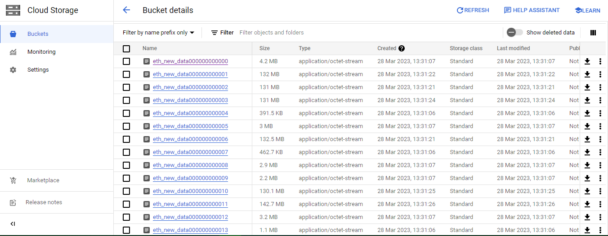

# Getting Data from the Public Blockchains

## Step 1:  Get Blocks and Transactions Data From  Google Cloud Platform Account &

Since we have data from the Blockchain ETL (open source project by Google) we open and confirm an account with GCP and go to the following services:

``` Big Query -> Search Explorer (crypto_ethereum) -> Select (blocks) ```

It should look something like this:


Next, we move on to:

``` Select 3 Dots -> Export table to Google Cloud Storage -> Select / Create GCS -> Enter filename (with a * in the end) -> Choose Parquet & GZIP formats ```

**Key Point**: File is too big, and we have a limitation to 1GB / File - so we use * in the end of the name to partition data into several files.

Next, after the task is done (can check the Personal History) we search for Cloud Storage and open the bucket we created.

The file should look like this:



Now its time to shift the data to S3.

---

## Step 2:  Get Blocks and Transactions Data From  Google Cloud Platform Account &