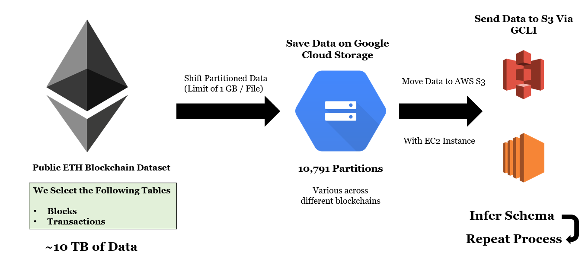

# Comprehensive List of Architectures and Hands on Implementation

Below you can find a list of comprehensive architectures and solutions build through AWS Cloud.
For each implementation you can find a step by set of code snippets, screenshots and explanations.

You can navigate through your preferred case on each title connected to the links below!

---

## [Getting Ethereum Blockchain Data](https://github.com/JShollaj/AWS-Solutions-Portfolio/blob/master/Getting%20Ethereum%20Blockchain%20Data.md)

Solution behind getting massive data from the public Blockchain ETL and shifting to AWS.

Main services used:
EC2, S3, Athena, DynamoDB

---

## [Streaming NFT  Data](https://github.com/JShollaj/AWS-Solutions-Portfolio/blob/master/Getting%20Ethereum%20Blockchain%20Data.md)

Solution behind getting massive data from the public Blockchain ETL and shifting to AWS.

Main services used:
S3, Kinesis Firehose, RDS, DynamoDB

---

